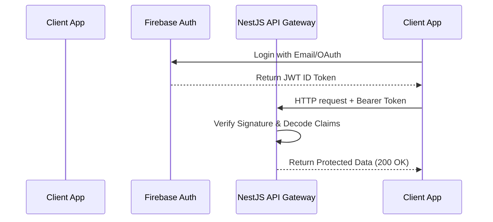

# Authentication & Authorization Specification

This document details the authentication and authorization mechanism across the Prarthna platform.

## Identity Provider: Firebase Auth

We delegate identity management to **Firebase Authentication** for both the Next.js admin dashboard and the Flutter mobile application.



## JWT Token Structure

The JWT token contains custom claims mapped to user roles:

```json
{
  "iss": "https://securetoken.google.com/prarthna-app",
  "aud": "prarthna-app",
  "sub": "firebase-uid-value",
  "email": "user@email.com",
  "role": "super_admin"
}
```

## NestJS Guards

Two NestJS guards secure the API endpoints:

1. **`FirebaseAuthGuard`:**
   - Extract the Bearer JWT token from the `Authorization` header.
   - Verify the signature using the Firebase certificate public keys.
   - Attach the decoded user object (containing Firebase UID, email, and role) to the request context.
2. **`RolesGuard`:**
   - Evaluates the `@Roles(...)` metadata decorator on the route.
   - Validates that the token's `role` claim satisfies the endpoint policy.

## Public vs Protected Endpoints

- **Public Endpoints:**
  - `GET /v1/health` (Service health check)
  - `GET /docs` (OpenAPI Swagger UI)
- **Protected Endpoints (All Roles):**
  - `GET /v1/content/collections`
  - `GET /v1/sankalp/my`
- **Restricted Endpoints (Admin/Editor Only):**
  - `POST /v1/content/collections`
  - `POST /v1/audio/transcribe`
